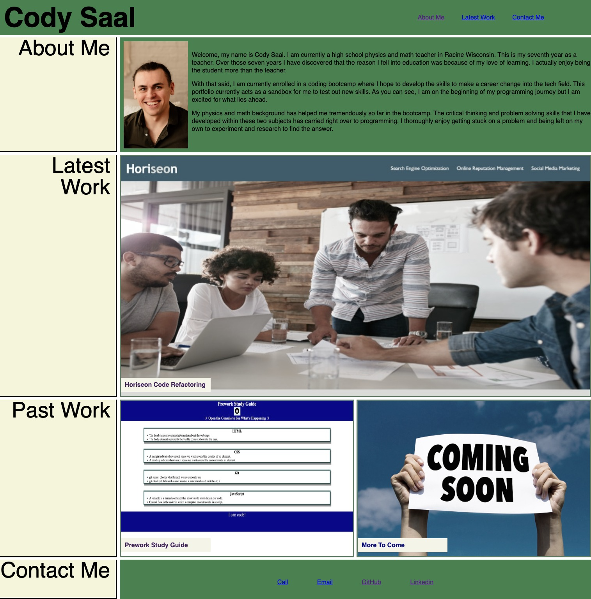

# My First Portfolio Page

## Description

This portfolio was created after learning about HTML and CSS. We covered advanced CSS (display:, @media, and more) the week I started this. I wanted to try and expand my display: knowledge and try out display:grid. My original ideas were ruled out due to not knowing JS yet so I decided to see if I could design the webpage given to us in our Bootcamp assignment's readme.

A portfolio page is something that will be useful to me in the future so that recruiters can find my latest work as well as how to contact me. This portfolio page provides me with a place to try new concepts as we learn them.  Eventually I plan to make a new portfolio that models more of my original ideas.

## Table of Contents (Optional)

N/A

## Installation

N/A

## Usage

## Credits

I used the video in the link below in order to get an understanding how display:grid worked.

[https://youtu.be/68O6eOGAGqA]

## License

N/A

